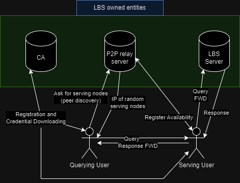

# Secure and Privacy-enhancing Decentralized Location-based Services: LBS-owned entities implementation for PoC

This is the implementation of the LBS-owned entities that are employed to realize a privacy-enhancing scheme for LBS users as it is described in my master's degree thesis: \<DiVA link to be added soon\>

### The mobile application

The implementation of the mobile appliation which the scheme's users are running can be found [here](https://github.com/MavrosOplarxigos/LBS_app_for_PoC).
Therefore, all the designed protocols of the thesis are realized by both the service's implementation (provided in this repo) and the mobile application which work in conjuction to realize the scheme.

## Abstract of the thesis

Location-based services have seen a growth in popularity in recent decades, which was facilitated by the advancements in mobile computing and innovations that allowed for devices to be location-aware. Therefore, multiple applications that integrate location information have been developed and made their way into the daily lives of the overage mobile device user. To highlight this last point here are some such applications; maps and navigation, social-media post geotagging, food delivery, ridesharing, and location-based gaming.

Due to the popularity of location-based services, their providers are handling massive amounts of data daily from a great number of users. Recent studies have shown these service providers to be honest-but-curious; they provide legit information but collect user data which can be used to infer sensitive information. The same narrative applies with other types of service providers as well, but in our specific case, one other important piece of sensitive information is location; past, current, or future.

Subsequently, many successful privacy-enhancing schemes have been introduced which utilize peer-to-peer communication on local ad-hoc wireless networks and attempt to obfuscate the correlation between user identity and user location by routing requests amongst users before reaching the provider, replacing exact location with fake location, use pseudonyms and information caching to reduce interaction with the provider. Such schemes though require a substantial number of users before becoming realizable; if users have no peers near them, they cannot join a peer network and thus have to communicate with the provider directly.

In this thesis, a scheme was designed to act as a fallback and predecessor of such wireless peer connectivity solutions by utilizing over-the-Internet peer connectivity and leveraging pseudonyms to achieve user privacy-enhancement. To test the functionality and fitness of the scheme both a mobile application and the orchestration entities were developed. Subsequently, experiments were conducted that show that with sharing a small number of peers with a user the peer-hit-ratio metric reaches a satisfactory value. The scheme uses mainstream cryptographic standards to allow for feature compatibility in future development. In addition, the system was developed to allow for many of its parameters to be adjustable in real-time, therefore allowing for future controller software to be integrated with it.

## Summary of the LBS entities

These entities, which realize the core functionality of the scheme are just as the included image shows, inside the green rectangle:

- The CA (Certification Authority): For maintaining the user certificates and the credentials of the service itself. As well as implementing the necessary cryptographic functionality and parsing of the credentials based on the standards that they follow.
- The P2P relay server: A server that provides for the peer discovery process by providing the users that query it with serving records (pairs of IP addressess and ports that point to other users of the scheme). This server at the same time implements checks for defending against flooding attacks and the mapping of the scheme's network.
- The LBS server: This entity is meant for providing with the general functionality of a LBS service. In practice, it uses Google's Places API to retrieve information for user queries and returns the responses to these queries signed so that the serving user can have proof for the legitimacy of their answers and non-repudiation.

  

All of the above entities are necessary for the scheme to be realized and as the thesis document considers they are owned by the LBS (and therefore the scheme) provider. That is, we don't need to speculate if their knowledge is shared in the current implementation but rather accept that it is shared since they are owned by the same operator (the LBS provider). In future developments, based on the open issues in this repo, this assumption might no logner be necessary.

## Credentials
The CA credentials are placed in a directory named "rsa_creds" in the same level as the repo and follow the naming convention as it can be seen in the "CA_server.py" file. Instructions on how to generate the credentials are provided in the master thesis document. In future iterations of this work the credential generation process will be fully automated.

## Experiments
This implementation also provides an additional server implementation for synchronizing the experiments that were run for the thesis as well as gathering the data that these generate. Additionally, a data analysis module for generating the respective graphs using the experimental data, was implemented.
